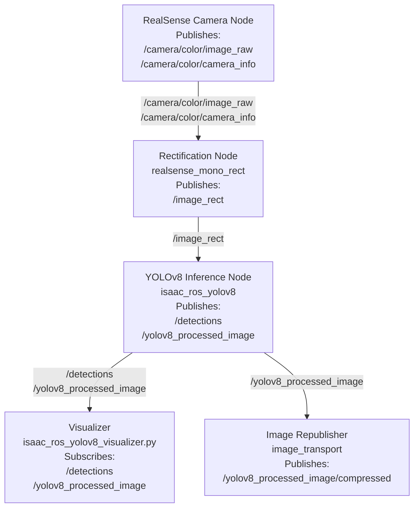

# ISAAC-ROS Object Detection Container

This repository provides a ROS 2–based object‑detection container using Isaac ROS YOLOv8 [NVIDIA-ROS-Object-Detection](https://nvidia-isaac-ros.github.io/v/release-3.2/repositories_and_packages/isaac_ros_object_detection/isaac_ros_yolov8/index.html). 

- automatic asset setup (default model only)

- selectable YOLOv8 model variants

- standalone mode (camera + detection in one container)

- multi‑container mode (camera in one container, detection in another)


The container is controlled entirely through environment variables in docker-compose.yml.

## 🚀 Quick Start

Build and run the container
```bash
docker compose up --build
```
The entrypoint will:

- check if the required YOLOv8 model assets exist

- download/export them if using the default model

- launch ROS in the selected mode


## ⚙️ Configuration (docker‑compose)

You control the container behavior using two environment variables:
YOLO_MODEL

Select which YOLOv8 model to run:

    yolov8s (default, auto‑downloadable)

    yolov8n, yolov8m, yolov8l, yolov8x (must be manually provided) #TODO implement auto pulling and conversion for other models

RUN_MODE

Choose how the container launches:

    standalone → camera + detection + visualization in one container

    multi → detection only, expects another container to provide camera topics

Example:
yaml

services:
  object_detection:
    environment:
      YOLO_MODEL: yolov8s
      RUN_MODE: standalone


## 📁 Asset Management

The container expects model assets in:
```
${ISAAC_ROS_WS}/isaac_ros_assets/models/yolov8/
```
Default model (yolov8s)

If missing, the container will automatically:

- download Isaac ROS assets
- export the YOLOv8s ONNX model

Non‑default models

If you set:
```
YOLO_MODEL=yolov8m
```
…then the container will not download the model.

You must manually place:
```
yolov8m.onnx
yolov8m.plan   (optional, will be generated by Isaac ROS if missing)
```
into:
```
isaac_ros_assets/models/yolov8/
```
If the files are missing, the container will exit with a clear error message.

## 🧠 Runtime Modes
Standalone Mode

Runs:

- RealSense camera pipeline
- YOLOv8 inference
- Visualization node
- Image republisher

Useful for development or running on a single machine.
Multi‑Container Mode

Runs only:

- YOLOv8 inference
- Visualization node
-  Image republisher

Assumes another container publishes camera topics.

